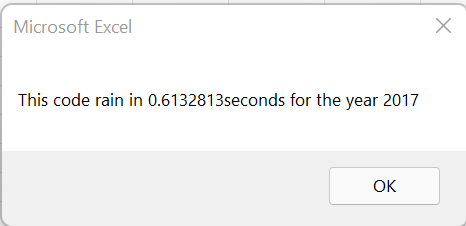
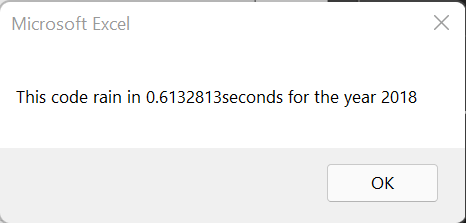
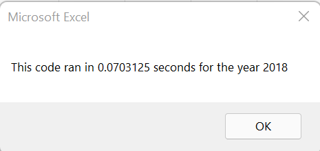

# Stock Analysis
## Overview

The purpose of this analysis is to produce some information on various stocks such as their volume for a certain year or return on value. With the touch of a button, this analysis can be run for a number of stocks. This analysis is color coded for easy interpretation. The analysis can be run quickly despite the amount of data.

## Results

Most of the stocks we examined had a positive rate of return in 2017 but the opposite is true for 2018. The only two stocks that positive rates of return for both years were ENPH and RUN. DQ had the highest rate of return in 2017 but with a low Daily Volume. 

The original script ran fast at about .61 seconds each for both 2017 and 2018 as shown below:

The refactored script ran for an even shorter amount of time, .07 seconds, for both 2017 and 2018 as shown below:

## Summary

Summary: In a summary statement, address the following questions.
What are the advantages or disadvantages of refactoring code?
How do these pros and cons apply to refactoring the original VBA script?

Structure, Organization, and Formatting Requirements (8 points)
The written analysis contains the following structure, organization, and formatting:

There is a title, and there are multiple paragraphs (2 pt).
Each paragraph has a heading (2 pt).
There are subheadings to break up text (2 pt).
Links are working, and images are formatted and displayed where appropriate (2 pt).
Analysis Requirements (12 points)
The written analysis has the following:

Overview of Project
The purpose and background are well defined (2 pt).
Results
The analysis is well described with screenshots and code (4 pt).
Summary
There is a detailed statement on the advantages and disadvantages of refactoring code in general (3 pt).
There is a detailed statement on the advantages and disadvantages of the original and refactored VBA script (3 pt).
