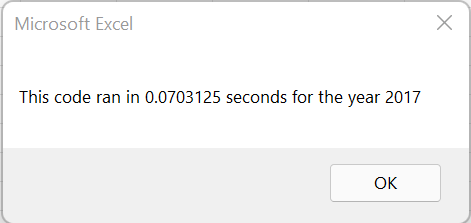

# Stock Analysis
## Overview

The purpose of this analysis is to produce some information on various stocks such as their volume for a certain year or return on value. With the touch of a button, this analysis can be run for a number of stocks. This analysis is color coded for easy interpretation. The analysis can be run quickly despite the amount of data.

## Results

Most of the stocks we examined had a positive rate of return in 2017 but the opposite is true for 2018. The only two stocks that positive rates of return for both years were ENPH and RUN. DQ had the highest rate of return in 2017 but with a low Daily Volume. 

The original script ran fast at about .61 seconds each for both 2017 and 2018 as shown below:

The refactored script ran for an even shorter amount of time, .07 seconds, for both 2017 and 2018 as shown below:

## Summary

One advantage of refactoring the code, the runtime is significantly decreased. You can see that by the difference between .61 seconds before and .07 seconds after. If more data is added, the runtime difference could be even greater.
